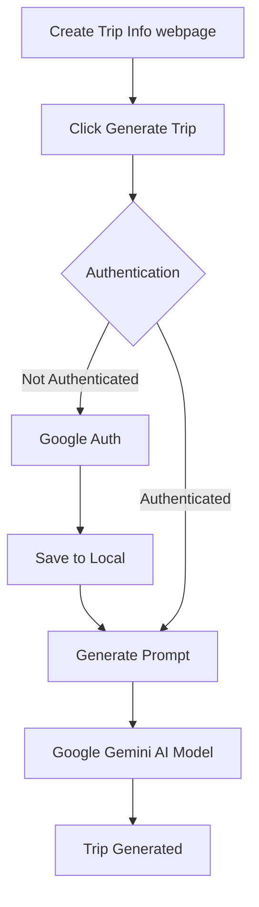

# 🌐 Smart AI Trip Planner

**Smart AI Trip Planner** is an intelligent travel planning web application that leverages AI to generate personalized travel itineraries, budget suggestions, and destination highlights. It helps users discover new places, plan day-wise trips, and get travel tips — all in one place, just by chatting with the smart AI assistant.

---

## 📌 Problem Statement

Planning a trip manually can be time-consuming and overwhelming, especially when comparing multiple destinations, costs, and activities. Travelers often need to visit multiple websites to gather this information. The **Smart AI Trip Planner** solves this by offering an all-in-one platform where users can simply interact with a chatbot to receive a customized trip plan.

---

## 🔍 Introduction

This project combines the power of artificial intelligence, real-time APIs, and user-centric UI to make travel planning smarter, faster, and more interactive. The goal is to provide a seamless experience where users can plan trips with just a few inputs — saving time and avoiding confusion.

---

## 📖 Background

With the rise of AI and travel APIs, the potential to automate and personalize travel experiences has become more feasible. Integrating services like OpenAI for trip logic, Google Places for real-time data, and Unsplash for images, we aimed to create a smart assistant that not only generates itineraries but also visualizes them attractively.

---

## 📚 Literature Review

| Study / Tool                  | Summary                                                                 |
|------------------------------|-------------------------------------------------------------------------|
| Google Places API            | Used to fetch real-time details of places, hotels, and restaurants.     |
| Unsplash API                 | Offers high-quality location-based images.                              |
| OpenAI GPT                   | Generates contextual responses and customized travel itineraries.       |
| Existing Travel Planners     | Most require manual input and lack dynamic, personalized conversation.  |
| Smart Chatbot Models         | Assist in task automation and user engagement in tourism applications.  |

---

## 💡 Proposed Solution

Our system provides:
- A chatbot interface to interact naturally with users
- AI-generated custom itineraries
- Budget estimation based on duration, preferences, and destination
- Day-wise activities with images and travel tips
- Real-time suggestions of places and stays using APIs

---

## 🧱 System Design

### 📊 Architecture Diagram

